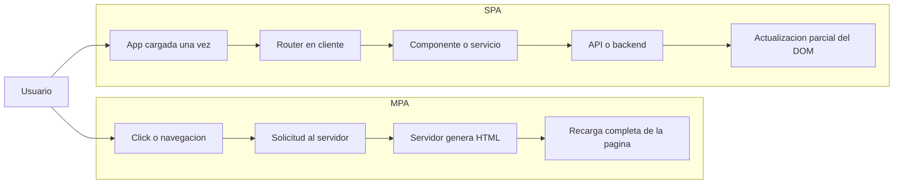
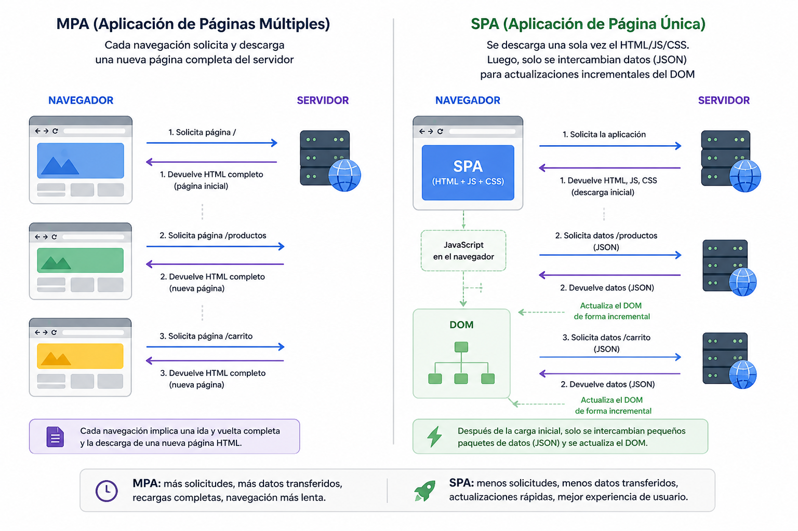
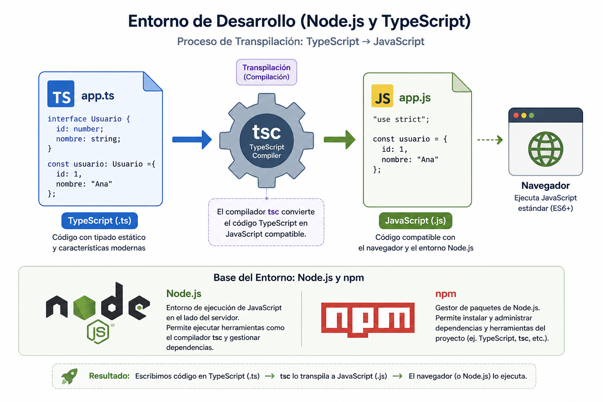
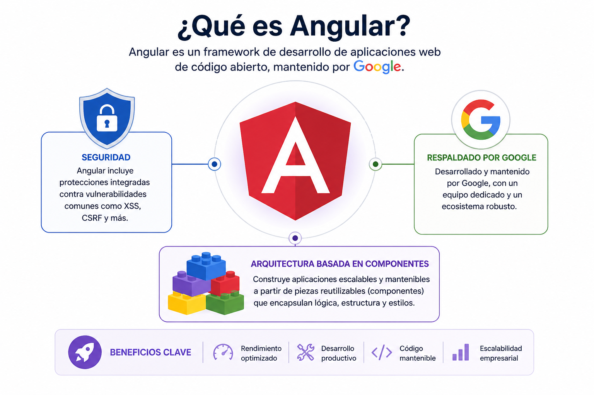
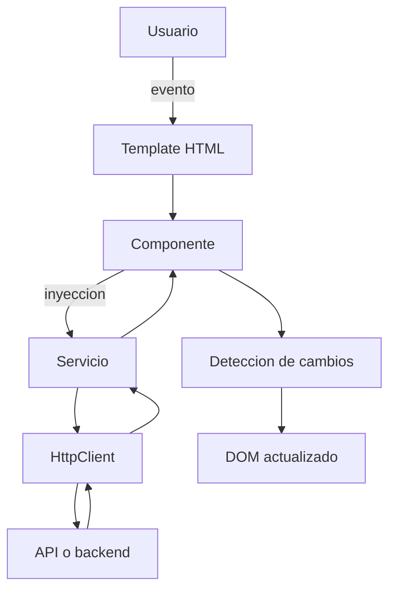
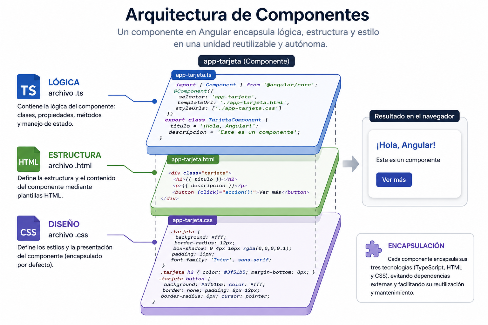
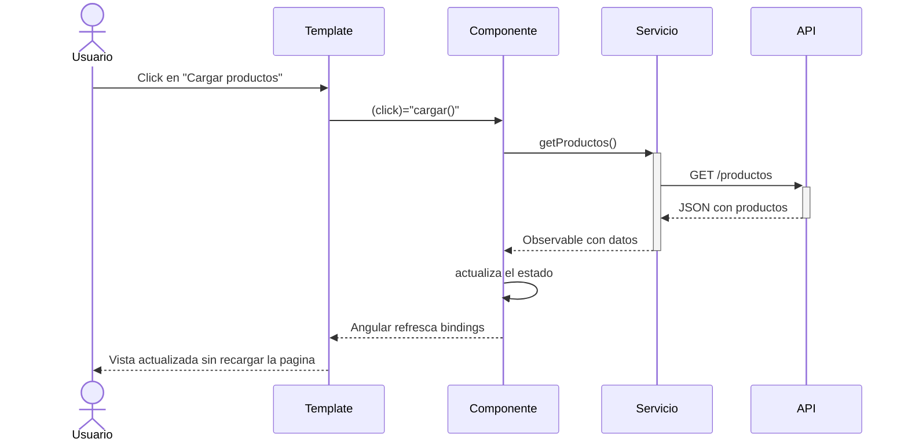

# Clase 2: SPA en Angular

## 1. Single-Page Application (SPA)

### Definición

Una SPA es una aplicación web que carga una única página HTML y actualiza el contenido dinámicamente a medida que el usuario interactúa con la aplicación, sin recargar la página completa. Utiliza tecnologías como JavaScript, HTML5 y CSS3 para crear experiencias interactivas y fluidas.

### Ejemplo

Aplicaciones como Gmail, Google Maps y Facebook son ejemplos de SPAs, donde el contenido se actualiza dinámicamente sin cargar una nueva página.

### Beneficios

- Experiencia de Usuario Fluida: Al no tener que recargar la página, los usuarios experimentan transiciones más suaves y rápidas.
- Menor Uso de Ancho de Banda: Solo se envían y reciben los datos necesarios en lugar de cargar toda la página nuevamente, lo que ahorra ancho de banda y acelera la carga.
- Interacción Más Rápida: La interacción es más rápida, ya que se pueden realizar cambios en el DOM sin recargar el navegador.
- Mejor Rendimiento en Dispositivos: Al reducir las recargas de página, se mejora el rendimiento en dispositivos móviles y conexiones lentas.
- Estado de la Aplicación: Facilita el manejo del estado de la aplicación en el navegador, lo que permite una mejor gestión de la experiencia del usuario.

### Desafíos de una SPA

- Carga Inicial Mayor: La primera carga puede ser más pesada si la aplicación descarga mucho JavaScript.
- SEO y Compartibilidad: Si no se aplica SSR o prerender, algunas SPAs pueden tener peor indexación o previews menos ricos.
- Mayor Complejidad en Front-End: El enrutado, el manejo de estado, la seguridad y los errores se resuelven más del lado cliente.
- Dependencia de JavaScript: Si JavaScript falla o se bloquea, la experiencia puede degradarse más que en una MPA tradicional.

## 2. Multi-Page Application (MPA)

### Cómo funciona

Una MPA consiste en múltiples páginas HTML que se cargan en el navegador cada vez que un usuario navega a una nueva sección de la aplicación. Cada interacción con la aplicación resulta en una nueva solicitud al servidor que devuelve una nueva página.

## DOM

El DOM es el puente entre el HTML estático y la capa de scripting; en MPA se reconstruye con cada página, mientras que en SPA se actualiza de forma incremental para ofrecer una experiencia más ágil y responsiva.

## SPA vs MPA en un Flujo Real



- En una MPA, la navegación suele implicar pedir una nueva página HTML al servidor.
- En una SPA, el navegador ya tiene cargada la aplicación y normalmente solo pide datos.
- Una SPA no elimina el backend: cambia qué se solicita con mayor frecuencia, de páginas completas a datos y recursos específicos.



## Node.js y Angular

Node.js es un runtime de JavaScript que permite ejecutar código JS fuera del navegador. Está construido sobre el motor V8 (el mismo de Chrome) y se usa principalmente para crear aplicaciones del lado del servidor (back-end), aunque también se emplea para herramientas de desarrollo, automatización y servidores web.

Aunque Angular es un framework para construir aplicaciones web del lado del cliente (front-end), Node.js cumple un rol fundamental en su entorno de desarrollo:

1. **Angular CLI (Command Line Interface):**
    La herramienta de línea de comandos para generar, compilar y servir proyectos Angular (`ng serve`, `ng build`, etc.) está construida en Node.js.
2. **npm:**
    Angular y sus dependencias se instalan y gestionan mediante `npm`, que corre sobre Node.js.
3. **Servidor de desarrollo:**
    Durante el desarrollo, `ng serve` levanta un servidor local basado en Node.js.
4. **Build y herramientas:**
    Herramientas como Webpack, TypeScript, Prettier o ESLint (usadas en proyectos Angular) se ejecutan gracias a Node.js.

Node.js ejecuta JavaScript en el back-end y proporciona el entorno de desarrollo para Angular. Angular depende de Node.js en desarrollo, pero el resultado final de una app Angular es puro JavaScript que puede correr sin Node.

### Aclaración Importante

- Angular corre en el navegador del usuario una vez compilado.
- Node.js se usa principalmente para instalar dependencias, compilar y levantar el servidor de desarrollo.
- En producción, lo habitual es servir los archivos generados (`HTML`, `CSS`, `JS`) desde un servidor web o CDN.



## Qué es Angular

- Es un Framework para el desarrollo web: Angular es un framework de desarrollo de aplicaciones web mantenido por Google, diseñado para crear aplicaciones de una sola página (SPA) con una experiencia de usuario fluida y dinámica.
- Uso de TypeScript: Angular se basa en TypeScript, un superconjunto de JavaScript que proporciona tipado estático.
- En Angular moderno, el enfoque con componentes standalone es la opción preferida para nuevas aplicaciones, aunque NgModules siguen existiendo en muchos proyectos.



## TypeScript

TypeScript es un lenguaje de programación desarrollado por Microsoft que agrega tipado estático y otras características a JavaScript. Es compatible con todos los navegadores, entornos de ejecución y bibliotecas de JavaScript.

- Tipos: Permite definir tipos de datos estáticos, lo que ayuda a detectar errores en tiempo de compilación.
- Interfaces y clases: Mejora la programación orientada a objetos.
- Decoradores: Proporciona un sistema de metaprogramación.

## El Proceso de Transpilación

### a. Escritura del Código en TypeScript

Los desarrolladores escriben el código en archivos con la extensión `.ts`. Este código puede incluir tipos, interfaces, clases y características que no están disponibles en versiones anteriores de JavaScript.

### b. Configuración del Compilador

El compilador TypeScript (`tsc`) se utiliza para transpilación. La configuración puede especificarse en un archivo `tsconfig.json`.

### c. Transpilación

El compilador `tsc` toma el código TypeScript y lo convierte a JavaScript. Durante esta fase, se realizan varias tareas:

```typescript
class Persona {
    constructor(public nombre: string) {}
    saludar() {
        return `Hola, mi nombre es ${this.nombre}`;
    }
}

// Transpilación a JavaScript (ES5)
var Persona = /** @class */ (function () {
    function Persona(nombre) {
        this.nombre = nombre;
    }
    Persona.prototype.saludar = function () {
        return "Hola, mi nombre es " + this.nombre;
    };
    return Persona;
}());
```

NVM (Node Version Manager) es una herramienta que permite gestionar múltiples versiones de Node.js en una máquina. Facilita la instalación, el cambio y la eliminación de versiones de Node.js sin necesidad de desinstalar la versión actual.

### d. Generación de Archivos JavaScript

El resultado de la transpilación son archivos `.js` que pueden ser ejecutados en cualquier entorno que soporte JavaScript.

## Beneficios de la Transpilación

- Detección temprana de errores.
- Mejor mantenibilidad.
- Compatibilidad con versiones anteriores.

## Patrones de Diseño en Angular

## 1. Inversión de Control (IoC) / Inyección de Dependencias (DI)

- Angular tiene un inyector de dependencias propio que gestiona automáticamente las instancias de servicios.
- Permite desacoplar componentes de las implementaciones concretas.
- Ejemplo: `constructor(private userService: UserService) {}`

## 2. Observador (Observer)

- Angular y RxJS implementan este patrón extensamente con Observables.
- Ejemplo: `this.userService.getUsers().subscribe(...)`

## 3. Singleton

- Los servicios en Angular, si están declarados en `providedIn: 'root'`, se comportan como singleton.

## 4. Fachada (Facade)

- Se aplica en arquitectura limpia usando servicios para encapsular lógica compleja y exponer una interfaz simple al componente.

## 5. Componente / Composición

- Angular se basa en una arquitectura component-based, donde cada UI se construye a partir de componentes reutilizables y aislados.

## 6. Mediador (Mediator)

- Angular usa `@Input()` y `@Output()` para la comunicación entre componentes.

## Angular y los Principios SOLID

## S – Single Responsibility Principle (SRP)

- Los componentes sólo manejan lógica de presentación.
- La lógica de negocio va en los servicios.

## O – Open/Closed Principle (OCP)

- Podemos extender funcionalidades con nuevos servicios o módulos sin modificar los existentes.

## L – Liskov Substitution Principle (LSP)

- Interfaces y clases base permiten que un componente o servicio pueda ser sustituido por una subclase.

## I – Interface Segregation Principle (ISP)

- Angular fomenta servicios pequeños y especializados en una única tarea.

## D – Dependency Inversion Principle (DIP)

- Los componentes y servicios dependen de abstracciones (interfaces) en lugar de implementaciones concretas.

## Angular en la práctica

## Primera aplicación Angular

[Primera aplicación](Primera%20aplicación.md)

## Cómo se Organiza una App Angular Real



- El template captura eventos del usuario.
- El componente coordina la interacción y mantiene estado de presentación.
- Los servicios encapsulan lógica de negocio o acceso a datos.
- Angular actualiza la vista cuando cambia el estado del componente.

Plugins recomendados:

- Angular Language Service
- Prettier – Code Formatter
- Angular Snippets
- Path Intellisense
- Material Icon Theme

## Arquitectura Basada en Componentes en Angular

## Componentes

[Componentes](Componentes.md)

- En Angular, los componentes son los bloques fundamentales de la interfaz de usuario. Cada componente es una parte independiente de la interfaz que se encarga de mostrar datos, manejar la lógica y responder a eventos del usuario.



## El Ciclo de Vida del Componente en Angular

Los principales hooks, en orden de ejecución, son:

## 1. `ngOnChanges()`

- Se ejecuta antes de `ngOnInit` y cada vez que uno o más de los atributos de entrada (`@Input()`) cambian.
- Propósito: Detectar y reaccionar a cambios en las propiedades de entrada de un componente.

## 2. `ngOnInit()`

- Se ejecuta una vez después de que Angular haya inicializado todas las propiedades enlazadas.
- Propósito: Realizar la lógica de inicialización del componente.

## 3. `ngDoCheck()`

- Se ejecuta después de cada ciclo de detección de cambios de Angular.
- Propósito: Gancho para implementar lógica de detección de cambios personalizada.

## 4. `ngAfterContentInit()` y `ngAfterContentChecked()`

- `ngAfterContentInit`: Se ejecuta una vez después de que Angular proyecte contenido externo.
- `ngAfterContentChecked`: Después de cada subsiguiente `ngDoCheck`.

## 5. `ngAfterViewInit()` y `ngAfterViewChecked()`

- `ngAfterViewInit`: Se ejecuta una vez después de que Angular haya inicializado completamente la vista del componente y las vistas de sus componentes hijos.
- `ngAfterViewChecked`: Después de cada subsiguiente `ngDoCheck`.

## 6. `ngOnDestroy()`

- Justo antes de que Angular destruya el componente.
- Propósito: Realizar tareas de limpieza para evitar fugas de memoria.

## Comunicación entre Componentes

## @Input() y @Output()

- Permiten enviar datos de un componente padre a un componente hijo y viceversa.
- Servicios: Se usan para compartir información y lógica entre componentes.

### Flujo Típico de una Interacción en Angular



## Tipos de Data Binding en Angular

## 1. Interpolación ({{ }})

```typescript
export class MiComponente {
  mensaje: string = 'Hola desde Angular';
}
```

```html
<p>{{ mensaje }}</p>
```

## 2. Property Binding ([ ])

```typescript
export class MiComponente {
  imagenUrl: string = 'https://ejemplo.com/imagen.jpg';
}
```

```html

```

## 3. Event Binding (( ))

```typescript
export class MiComponente {
  mensaje: string = '';

  mostrarMensaje() {
    this.mensaje = '¡Botón presionado!';
  }
}
```

```html
<button (click)="mostrarMensaje()">Haz clic aquí</button>
<p>{{ mensaje }}</p>
```

## 4. Two-Way Data Binding ([( )])

```typescript
export class MiComponente {
  nombre: string = '';
}
```

```html
<input [(ngModel)]="nombre" placeholder="Escribe tu nombre" />
<p>Hola, {{ nombre }}!</p>
```

Nota: para usar `[(ngModel)]`, normalmente debes importar `FormsModule` en el componente o módulo correspondiente.

## Cuándo Usar Cada Tipo de Binding

- Interpolación: Cuando necesitas mostrar información del componente en la vista.
- Property Binding: Para enlazar propiedades HTML con valores del componente.
- Event Binding: Cuando necesitas que la vista le envíe información al componente.
- Two-Way Data Binding: Para sincronizar automáticamente los datos en ambos sentidos.

## Directivas en Angular

Una directiva es una clase de TypeScript que modifica el comportamiento o la estructura del DOM, y Angular la reconoce porque tiene el decorador `@Directive` (o `@Component`, que es una extensión de `@Directive`).

## Tipos

- Componentes: Un componente es una directiva con template.
- Directivas de atributos: Modifican la apariencia o comportamiento de un elemento existente.
  - `[ngClass]`, `[ngStyle]`, `ngModel`
- Directivas estructurales: Alteran la estructura del DOM.
  - `ngIf`, `ngFor`, `ngSwitch`

## Ejemplo de Directiva Propia

```typescript
import { Directive, Input, TemplateRef, ViewContainerRef } from '@angular/core';

@Directive({
  selector: '[appSi]'
})
export class AppSiDirective {
  constructor(
    private templateRef: TemplateRef<any>,
    private viewContainer: ViewContainerRef
  ) {}

  @Input() set appSi(condicion: boolean) {
    this.viewContainer.clear();
    if (condicion) {
      this.viewContainer.createEmbeddedView(this.templateRef);
    }
  }
}
```

## Decoradores de Clase en Angular

## 1. @Component

Marca una clase como un componente.

## 2. @Directive

Declara una directiva sin template.

## 3. @Pipe

Declara un pipe para transformar datos en el template.

## 4. @Injectable

Indica que la clase es un servicio o provider inyectable.

## 5. @NgModule

Usado para agrupar componentes, directivas, pipes, servicios, etc., en un módulo lógico.

## Servicios en Angular: Lógica de Negocio y Reutilización

Los servicios son clases de TypeScript que encapsulan lógica de negocio, acceso a datos o cualquier funcionalidad que necesite ser compartida entre múltiples componentes. En aplicaciones reales, ayudan a que los componentes no queden sobrecargados con reglas de negocio o llamadas HTTP.

## Por qué usar Servicios

1. Separación de Responsabilidades.
2. Reutilización del Código.
3. Testabilidad.
4. Mantenimiento.
5. Singleton Pattern por Defecto.

## Inyección de Dependencias

Angular utiliza un patrón de Inyección de Dependencias (DI) para proporcionar a las clases sus dependencias.

- `@Injectable()`: Marca la clase como un proveedor de inyección de dependencias.
- `providedIn: 'root'`: Hace que Angular cree una única instancia global del servicio.
- `'any'`: El servicio se proporciona en el primer módulo o contexto que lo inyecte.
- `@NgModule({ providers: [MovieService] })`: Proporciona el servicio solo a un NgModule específico.
- `@Component({ providers: [MovieService] })`: Proporciona el servicio a nivel de componente.

## Llamadas a una API con `HttpClient`

1. Habilitar `HttpClient`: En `src/app/app.config.ts` al añadir `provideHttpClient()` a los `providers`.
2. Inyectar `HttpClient`: Preferentemente dentro de un servicio que centralice el acceso a datos.
3. Consumir el servicio desde el componente: El componente pide datos al servicio y actualiza su estado.

## Inyección de Dependencias (DI) en Detalle

1. El Sistema de Inyección: Cuando una clase declara una dependencia en su constructor, Angular busca en el inyector.
2. Ámbito de los Inyectores: Angular tiene una jerarquía de inyectores. Cada componente y cada módulo tiene su propio inyector. Si un servicio se proporciona en múltiples niveles, el componente obtendrá la instancia más cercana en la jerarquía.
