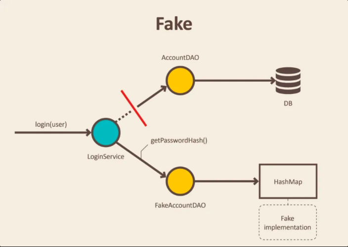
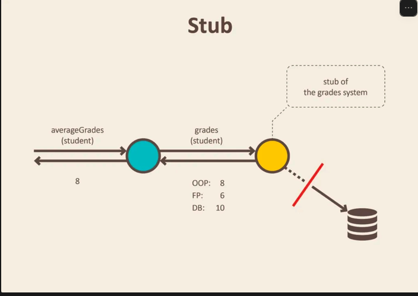
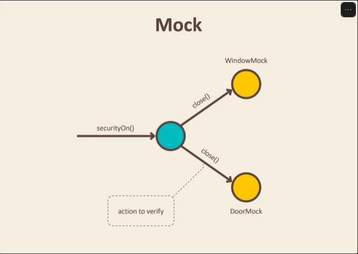

# TDD

## TDD y pruebas unitarias

Veníamos desarrollando usando Test-Driven Development (TDD). Lo hacíamos a nivel de prueba unitaria. Recordemos el acrónimo FIRST que nos ayuda a determinar las características que hacen a una buena prueba unitaria:

- Fast: las pruebas unitarias deben ser de ejecución rápida.
- Isolated: las pruebas deben ser autocontenidas. No deben depender de otras.
- Repeatable: deben ser deterministas. Deben correr bien sin importar cuándo ni dónde.
- Self-validating: la prueba debe automáticamente determinar su éxito o fracaso.
- Timely: idealmente, escritas antes del código.

Las pruebas siempre tienen tres etapas: Arrange, Act, Assert. Salvo excepciones, un único assert por prueba.

Otra noción importante es la de System Under Test (SUT). El SUT es la porción de un sistema que estamos probando. Por ejemplo, si tenemos dos endpoints HTTP, un GET y un POST, y determinamos que queremos probar unitariamente el método de acción GET, entonces nuestra prueba debería probar solamente el método de acción mapeado a un HttpGet.

No debería probar ningún otro método, como por ejemplo podría ser el POST.

## Ejemplo de SUT con dependencias

Volvamos al método GET que definimos al comienzo del curso:

```csharp
[HttpGet]
public IActionResult GetMovieByPostfix([FromQuery] string? endsWith) 
{
    IEnumerable<GetMovieResponse> movies = movieLogic.GetMoviesByPostfix(endsWith)
        .Select(s => new GetMovieResponse(s));
    if(endsWith is null)
    {
        return Ok();
    }
    return Ok(movies);
}
```

El método de acción tiene una sentencia importante a destacar:

```csharp
movieLogic.GetMoviesByPostfix(endsWith)
    .Select(s => new GetMovieResponse(s));
```

En particular:

```csharp
movieLogic.GetMoviesByPostfix(endsWith)
```

El método de acción delega responsabilidad a otro objeto, es decir, tiene una dependencia. A nivel de prueba unitaria, esta invocación no debería ocurrir.

En caso de que ocurra, nuestra prueba no sería más unitaria a nivel de método; sería en su lugar una prueba de integración.

## ¿Entonces qué pasó en DA1?

En DA1 solemos permitir este tipo de pruebas de integración. No solo entre dependencias a nivel de código, sino también a nivel de Entity Framework. Cada dictado maneja Entity Framework diferente, pero por lo general se proponían dos soluciones:

- Crear una base de datos de prueba, con un connection string específico para el proyecto de pruebas. Habitualmente, la base de datos se vacía entre pruebas.
- Usar una base de datos en memoria.

En cualquier escenario, estamos incluyendo base de datos en nuestro flujo de ejecución de prueba. Si por alguna razón algo saliera mal a nivel de base de datos, la prueba se podría romper: no es unitaria.

Parte del objetivo de este tema es solucionar ese problema, no solo a nivel de base de datos, sino también a nivel de dependencia entre objetos.

### Qué son las pruebas unitarias

Tener pruebas automáticas es una gran manera de asegurarte de que el software hace lo que los desarrolladores pretendían que hiciera. Hay múltiples tipos de pruebas: pruebas de integración, pruebas web y muchas más. Las pruebas unitarias son pruebas individuales de componentes de software y métodos.

Las pruebas unitarias deberían probar únicamente código que esté al alcance del desarrollador. No deberían probar conceptos de infraestructura, con esto me refiero a base de datos, file system y network.

Para crear pruebas unitarias podemos usar diferentes frameworks:

- xUnit
- NUnit
- MSTest (este framework es el que vamos a utilizar)

El sentido de las pruebas unitarias es poder probar nuestro código evitando probar también sus dependencias, asegurándonos que los errores se restrinjan únicamente al código que efectivamente queremos probar. Para ello, utilizaremos una herramienta que nos permitirá crear mocks (un tipo de test doubles). Esa herramienta se llama Moq.

### Qué son los mocks

Los mocks son uno de los varios test doubles (objetos que no son reales respecto a nuestro dominio, y que se usan con finalidades de testing) que existen para probar nuestros sistemas. Los más conocidos son los mocks y los stubs, siendo la principal diferencia en ellos el foco de lo que se está testeando.

Antes de hacer énfasis en tal diferencia, es importante aclarar que nos referimos a la sección del sistema a probar como SUT (System Under Test). Los mocks nos permiten verificar la interacción del SUT con sus dependencias. Los stubs nos permiten verificar el estado de los objetos que se pasan. Como queremos testear el comportamiento de nuestro código, utilizaremos los primeros.


### Ejemplos de test doubles

#### Fake

Un ejemplo de este atajo puede ser una implementación en memoria de un objeto o repositorio de acceso a datos. Esta implementación fake no utilizará la base de datos, sino que utilizará una colección simple para almacenar datos. Esto nos permite realizar pruebas de integración de servicios sin iniciar una base de datos y realizar solicitudes que consumen mucho tiempo.



#### Stub

Un ejemplo puede ser un objeto que necesita tomar algunos datos de la base de datos para responder a una llamada a un método. En lugar del objeto real, introducimos un stub y definimos qué datos debían devolverse.



#### Mock

Usamos mocks cuando no queremos invocar el código de producción o cuando no hay una manera fácil de verificar que se ejecutó el código deseado. No existe un valor de retorno ni una forma sencilla de comprobar el cambio de estado del sistema.

Un ejemplo puede ser una funcionalidad que llama al servicio de envío de correo electrónico. No queremos enviar correos electrónicos cada vez que ejecutamos una prueba. Además, no es fácil verificar en las pruebas que se envió un correo electrónico correcto. Lo único que podemos hacer es verificar los resultados de la funcionalidad que se ejerce en nuestra prueba. En otras palabras, verificar que se haya llamado al servicio de envío de correo electrónico.



## Dependencias: qué mockear

Veamos a qué nos referimos con dependencias y qué es lo que hay que mockear con un diagrama.

En nuestra arquitectura creamos un proyecto BusinessLogic que dependerá (usará) el componente IDataAccess:


Entonces supongamos que queremos probar el método GetAllCharacters de la clase ICharacterService. Este método para realizar la operación utiliza la interfaz ICharacterManagment llamando al comportamiento GetAllCharacters.

Si la prueba no usa mock con ICharacterManagment, se va a terminar probando código de la implementación de ese método, en donde puede aparecer un error en forma de bug, entonces nuestra prueba falla y no entendemos por qué.

A este tipo de pruebas que no solamente prueban el código sino que también las dependencias se les llaman pruebas de integración, y estas no son las que vamos a realizar.

Las pruebas unitarias nos van a ayudar a detectar problemas rápidamente del código que se está probando, ya que es el que está más a nuestro alcance, y nos despreocupamos de los bugs de las dependencias.

Cuando hacemos pruebas unitarias, queremos probar objetos y la forma en que estos interactúan con otros objetos. Para ello existen las instancias de mocks, es decir, objetos que simulan el comportamiento externo (en este caso de la interfaz ICharacterManagment) de un cierto objeto.

## Consecuencia

Gracias al uso de mocks y de las pruebas unitarias nos vemos forzados a acoplarnos a interfaces y no a implementaciones, lo cual nos provoca un bajo acoplamiento entre clases y sus dependencias.

Esto nos ayuda mucho también en esos componentes que dependen de un recurso externo como por ejemplo una librería de terceros, una red, un archivo o una base de datos.
