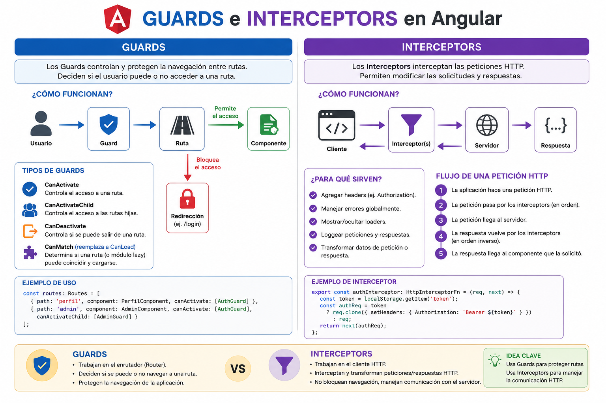

# 1. Guards en Angular

## 1.1 Qué es un guard

Un guard en Angular es una función que decide si se permite o no la navegación hacia una ruta.

Se usa para proteger pantallas, validar estado de sesión y evitar salidas accidentales.

Ejemplos típicos:

- permitir entrar a `/profile` solo si hay sesión;

- redirigir a `/login` si no hay autenticación;

- bloquear la salida de un formulario con cambios sin guardar;

- evitar cargar módulos si el usuario no cumple una condición.

Idea clave:

> Un guard controla navegación. No controla requests HTTP.

---

## 1.2 Tipos principales de guards

| Guard              | Para qué sirve                       | Caso común                             |
| ------------------ | ------------------------------------ | -------------------------------------- |
| `CanActivate`      | Decide si se entra a una ruta        | Proteger `/profile`                    |
| `CanActivateChild` | Protege rutas hijas                  | Proteger todo `/admin/*`               |
| `CanDeactivate`    | Decide si se puede salir de una ruta | Evitar perder cambios de un formulario |
| `CanMatch`         | Decide si una ruta puede matchear    | Bloquear lazy loading según sesión/rol |

---

## 1.3 AuthService con `localStorage`

Una forma simple de centralizar el manejo de sesión es crear un servicio que lea, guarde y elimine el token.

```ts
import { Injectable } from "@angular/core";

@Injectable({
  providedIn: "root",
})
export class AuthService {
  private readonly tokenKey = "access_token";

  login(token: string): void {
    localStorage.setItem(this.tokenKey, token);
  }

  logout(): void {
    localStorage.removeItem(this.tokenKey);
  }

  getToken(): string | null {
    return localStorage.getItem(this.tokenKey);
  }

  isAuthenticated(): boolean {
    return !!this.getToken();
  }
}
```

Para una demo de clase, se podría llamar así:

```ts
authService.login("fake-jwt-token");
```

---

## 1.4 Ejemplo de `CanActivate` (auth guard)

```ts
import { inject } from "@angular/core";

import { CanActivateFn, Router } from "@angular/router";

import { AuthService } from "./auth.service";

export const authGuard: CanActivateFn = () => {
  const authService = inject(AuthService);

  const router = inject(Router);

  const hasSession = authService.isAuthenticated();

  return hasSession ? true : router.createUrlTree(["/login"]);
};
```

Explicación:

1. Le pregunta al `AuthService` si existe sesión local.

2. Si hay sesión, permite navegar (`true`).

3. Si no hay sesión, redirige a login con `createUrlTree`.

---

## 1.5 Ejemplo de `CanMatch` (lazy loading)

```ts
import { inject } from "@angular/core";

import { CanMatchFn, Router } from "@angular/router";

import { AuthService } from "./auth.service";

export const authMatchGuard: CanMatchFn = () => {
  const authService = inject(AuthService);

  const router = inject(Router);

  const hasSession = authService.isAuthenticated();

  return hasSession ? true : router.createUrlTree(["/login"]);
};
```

La lógica sea parecida a la de `CanActivate`

---

## 1.6 Ejemplo de `CanDeactivate` (cambios sin guardar)

```ts
import { CanDeactivateFn } from "@angular/router";

export interface HasUnsavedChanges {
  hasUnsavedChanges: () => boolean;
}

export const pendingChangesGuard: CanDeactivateFn<HasUnsavedChanges> = (
  component,
) => {
  if (!component.hasUnsavedChanges()) {
    return true;
  }

  return confirm("Tenés cambios sin guardar. ¿Querés salir igual?");
};
```

Este guard pregunta confirmación solo cuando hay cambios pendientes.

---

## 1.7 Registro de guards en rutas

```ts
import { Routes } from "@angular/router";

import { authGuard } from "./auth/auth.guard";

import { authMatchGuard } from "./auth/auth-match.guard";

import { pendingChangesGuard } from "./guards/pending-changes.guard";

export const routes: Routes = [
  {
    path: "login",

    loadComponent: () =>
      import("./login/login.component").then((m) => m.LoginComponent),
  },

  {
    path: "profile",

    loadComponent: () =>
      import("./profile/profile.component").then((m) => m.ProfileComponent),

    canActivate: [authGuard],
  },

  {
    path: "edit-profile",

    loadComponent: () =>
      import("./profile-edit/profile-edit.component").then(
        (m) => m.ProfileEditComponent,
      ),

    canDeactivate: [pendingChangesGuard],
  },

  {
    path: "admin",

    canMatch: [authMatchGuard],

    loadChildren: () =>
      import("./admin/admin.routes").then((m) => m.adminRoutes),
  },
];
```

---

> El guard mejora UX y control de navegación. La seguridad real siempre debe validarla el backend.

---

# 2. Interceptors en Angular

## 2.1 Qué es un interceptor

Un interceptor en Angular es una función que permite intervenir las requests y responses HTTP de la aplicación.

Sirve para aplicar lógica transversal, es decir, lógica que se repite en muchas llamadas HTTP.

Ejemplos típicos:

- agregar el token JWT en cada request;

- manejar errores HTTP globales;

- redirigir al login cuando el backend devuelve `401 Unauthorized`;

- mostrar u ocultar un loader global;

- agregar headers comunes;

- registrar logs de requests;

- transformar respuestas antes de que lleguen al componente.

Idea clave:

> Un interceptor no controla navegación. Controla tráfico HTTP.

---

## 2.2 Diferencia entre guard e interceptor

| Elemento    | Responsabilidad                         | Ejemplo                                          |
| ----------- | --------------------------------------- | ------------------------------------------------ |
| Guard       | Controla si se puede navegar a una ruta | No permitir entrar a `/profile` si no hay sesión |
| Interceptor | Controla requests y responses HTTP      | Agregar `Authorization: Bearer token`            |
| Backend     | Aplica la seguridad real                | Validar token, permisos y reglas de negocio      |

Ejemplo simple para explicar en clase:

> El guard evita que el usuario llegue a una pantalla si no está autenticado.

> El interceptor agrega el token cuando la pantalla hace llamadas al backend.

> El backend valida realmente si ese token es válido y si el usuario tiene permisos.

---

## 2.3 Por qué el guard no alcanza como seguridad

Un guard corre en el frontend.

Eso significa que:

- el usuario podría manipular el código del navegador;

- podría llamar directamente al backend con Postman;

- podría modificar el `localStorage`;

- podría intentar acceder a endpoints aunque la pantalla esté bloqueada.

Por eso:

> El guard mejora la experiencia de usuario, pero no reemplaza la seguridad del backend.

La seguridad real debe estar siempre en el backend.



---

# 3. Interceptor básico para agregar token

En Angular moderno se pueden usar interceptors funcionales.

## Crear archivo

Una posible ubicación:

```txt
src/app/auth/auth.interceptor.ts
```

## Código

```ts
import { HttpInterceptorFn } from "@angular/common/http";

export const authInterceptor: HttpInterceptorFn = (req, next) => {
  const token = localStorage.getItem("access_token");

  if (!token) {
    return next(req);
  }

  const requestWithToken = req.clone({
    setHeaders: {
      Authorization: `Bearer ${token}`,
    },
  });

  return next(requestWithToken);
};
```

## Explicación

El interceptor hace esto:

1. Lee el token desde `localStorage`.

2. Si no hay token, deja pasar la request original.

3. Si hay token, clona la request.

4. Agrega el header `Authorization`.

5. Envía la request modificada.

Punto importante:

> Las requests HTTP en Angular son inmutables. Por eso no se modifican directamente, se clonan con `req.clone()`.

---

# 4. Registrar un interceptor funcional

En Angular standalone, se registra usando `provideHttpClient` y `withInterceptors`.

Ejemplo en `app.config.ts`:

```ts
import { ApplicationConfig } from "@angular/core";

import { provideRouter } from "@angular/router";

import { provideHttpClient, withInterceptors } from "@angular/common/http";

import { routes } from "./app.routes";

import { authInterceptor } from "./auth/auth.interceptor";

export const appConfig: ApplicationConfig = {
  providers: [
    provideRouter(routes),

    provideHttpClient(withInterceptors([authInterceptor])),
  ],
};
```

Con esto, todas las llamadas hechas con `HttpClient` pasan por el interceptor.

---

# 5. Interceptor para manejar errores 401

Un caso muy común es detectar cuando el backend responde `401 Unauthorized`.

Eso suele significar que:

- el usuario no está autenticado;

- el token venció;

- el token es inválido;

- el backend rechazó la credencial enviada.

Ejemplo:

```ts
import { inject } from "@angular/core";

import { HttpErrorResponse, HttpInterceptorFn } from "@angular/common/http";

import { Router } from "@angular/router";

import { catchError, throwError } from "rxjs";

export const authErrorInterceptor: HttpInterceptorFn = (req, next) => {
  const router = inject(Router);

  return next(req).pipe(
    catchError((error: HttpErrorResponse) => {
      if (error.status === 401) {
        localStorage.removeItem("access_token");

        router.navigate(["/login"]);
      }

      return throwError(() => error);
    }),
  );
};
```

## Explicación

Este interceptor:

1. Deja pasar la request.

2. Espera la respuesta.

3. Si la respuesta tiene error `401`, elimina el token.

4. Redirige al login.

5. Devuelve el error para que otros componentes o servicios puedan manejarlo si corresponde.

---

# 6. Registrar más de un interceptor

Se pueden registrar varios interceptors.

```ts
provideHttpClient(withInterceptors([authInterceptor, authErrorInterceptor]));
```

El orden importa.

En este ejemplo:

1. `authInterceptor` agrega el token.

2. `authErrorInterceptor` maneja errores de autenticación.

---

## 7. Pipes en Angular

### 7.1 Qué es un pipe

Un pipe en Angular transforma un valor para mostrarlo en la plantilla.

Sirve para formatear datos sin ensuciar el HTML ni mover lógica simple al componente.

Ejemplos típicos:

- mostrar una fecha con formato;

- transformar texto a mayúsculas;

- mostrar una moneda;

- convertir minutos en horas y minutos.

Idea clave:

> Un pipe transforma datos para la vista. No reemplaza servicios, guards ni interceptors.

---

### 7.2 Pipes comunes de Angular

| Pipe        | Para qué sirve          | Ejemplo                      |
| ----------- | ----------------------- | ---------------------------- |
| `uppercase` | Pasa texto a mayúsculas | `angular` → `ANGULAR`        |
| `lowercase` | Pasa texto a minúsculas | `Angular` → `angular`        |
| `titlecase` | Capitaliza palabras     | `hola mundo` → `Hola Mundo`  |
| `date`      | Formatea fechas         | `2026-05-25` → `25/05/2026`  |
| `currency`  | Formatea importes       | `250` → `$250`               |
| `percent`   | Formatea porcentajes    | `0.35` → `35%`               |

Ejemplo en template:

```html
<p>{{ movie.title | uppercase }}</p>

<p>{{ movie.releaseDate | date: "dd/MM/yyyy" }}</p>
```

---

### 7.3 Pipe personalizado: duración de película

Si una película guarda su duración en minutos, un pipe puede mostrarla de una forma más clara.

#### Crear archivo del pipe

Una posible ubicación:

```txt
src/app/shared/pipes/duration.pipe.ts
```

#### Código del pipe

```ts
import { Pipe, PipeTransform } from "@angular/core";

@Pipe({
  name: "duration",

  standalone: true,
})
export class DurationPipe implements PipeTransform {
  transform(minutes: number | null | undefined): string {
    if (minutes == null) {
      return "Sin duración";
    }

    const hours = Math.floor(minutes / 60);

    const remainingMinutes = minutes % 60;

    if (hours === 0) {
      return `${remainingMinutes} min`;
    }

    return `${hours} h ${remainingMinutes} min`;
  }
}
```

#### Uso en un componente standalone

```ts
import { Component } from "@angular/core";

import { DurationPipe } from "../shared/pipes/duration.pipe";

@Component({
  selector: "app-movie-card",

  standalone: true,

  imports: [DurationPipe],

  template: `
    <h3>{{ movie.title }}</h3>

    <p>Duración: {{ movie.durationInMinutes | duration }}</p>
  `,
})
export class MovieCardComponent {
  movie = {
    title: "Interestelar",

    durationInMinutes: 169,
  };
}
```

#### Explicación del ejemplo

Este pipe hace esto:

1. Recibe la duración en minutos.

2. Calcula horas y minutos.

3. Devuelve un texto más legible para la UI.

4. Si no hay valor, devuelve `"Sin duración"`.

Si el valor es `169`, en pantalla se muestra:

```txt
2 h 49 min
```

---

### 7.4 Cuándo conviene usar un pipe

Conviene usar un pipe cuando:

- la transformación es de presentación;

- querés reutilizar el mismo formato en varias pantallas;

- la lógica es simple y se entiende mejor desde el template.

No conviene usar un pipe cuando:

- la lógica depende de llamadas HTTP;

- necesitás navegar o manejar sesión;

- la transformación pertenece a negocio y no a presentación.

---

> El pipe mejora la legibilidad del template y reutiliza formato de datos en la vista.

