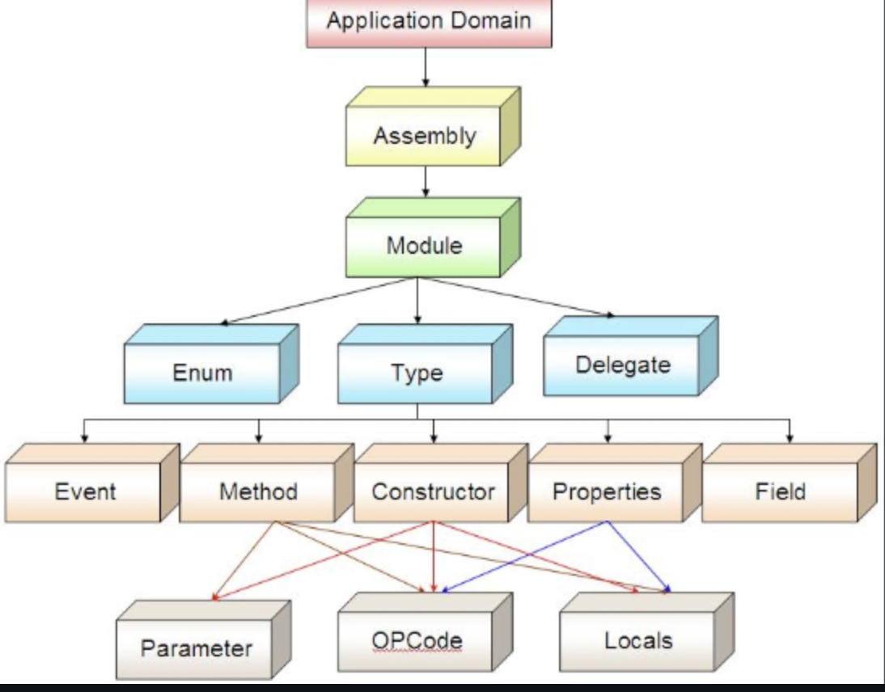

# ¿Qué es Reflection?

- **Reflection** es una técnica o caracteristica de una aplicacion para obtener informacion sobre ella misma. Permite ver y manipular clases, tipos, métodos, propiedades, eventos y otros miembros de una clase o estructura en **tiempo de ejecución**, es decir, mientras el programa se está ejecutando, sin necesidad de conocer esta información en el momento de la compilación.

## Principales usos

- Reflection es esencial en situaciones donde el tipo exacto de un objeto **no es conocido en tiempo de compilación**.
- Permite:
  - Acceder a los metadatos de un objeto o tipo
  - Obtener información sobre assemblies, módulos y tipos.
  - Llamar e invocar métodos y propiedades dinámicamente.
  - Crear instancias de clases o tipos de objeto en tiempo de ejecución.
  - Invocar métodos
  - Serialización y deserialización de objetos dinámicos

<aside>
***Todo sin conocer la estructura en tiempo de compilación…***
</aside>

Supongamos que tenemos una clase

```csharp
public class Person
{
    public string Name { get; set; }

    public void SayHello()
    {
        Console.WriteLine($"Hello, my name is {Name}");
    }
}
```

Sin reflection se definiria asi:

```csharp
var p = new Person();
p.Name = "Aditya";
p.SayHello();
```

Con Reflection intentaremos conseguir el mismo resultado pero dinámicamente así

```csharp
using System;
using System.Reflection;

class Program
{
    static void Main()
    {
        // Load the type(class)
        Type type = typeof(Person);

        // Create object(instance) dynamically
        object obj = Activator.CreateInstance(type);

        // Set property "Name"
        PropertyInfo prop = type.GetProperty("Name");
        prop.SetValue(obj, "Aditya");

        // Call method "SayHello"
        MethodInfo method = type.GetMethod("SayHello");
        method.Invoke(obj, null);
    }
}
```

## Casos comunes de uso

1. *Entity Framework (EF)* utiliza reflection para sus implementaciones y así, mappear entre las entidades de nuestro dominio y la base de datos.

- Si definimos una clase `Producto`...

```csharp
public class Producto
{
    [Key]
    public int Id { get; set; }

    [Required]
    public string Nombre { get; set; }
}
```

- EF utilizará los distintos métodos de reflection para obtener las propiedades, atributos y así, lograr mappear la entidad que implementamos.

3. **Inspección de metadatos** — Cuando necesita realizar algunas acciones basadas en los atributos, debe obtener metadatos en tiempo de ejecución.
4. **Serialización/ORM** — Serializador/deserializador como NewtonSoft.json, System.Text.json, XMLSerializer, etc. utiliza Reflection detrás de escena. Podemos usarlo para convertir objetos hacia/desde JSON, XML, etc.
5. **Pruebas/Proxies** — Cuando necesitamos generar servidores proxy para simular miembros privados/protegidos para conjuntos de pruebas/depuración, etc. o necesitamos acceder a miembros privados/protegidos en las pruebas.

# Estructura de un assembly

# ¿Qué es un *assembly*?

Brevemente, es el resultado de compilar el programa. La unidad básica de compilación y despliegue.

- Sus formas más comunes son *.DLL* (librería) y *.EXE* (ejecutable)
- Es utilizado para distribuir y ejecutar una aplicación o compartir una librería.

<aside>
💡

*En reflection nos importa conocer que es un assembly ya que vamos a poder acceder a ellos en tiempo de ejecución.*

</aside>

# ¿Cómo está compuesto?

Un **ensamblado** (**assembly**) es la **unidad básica de despliegue, ejecución y versión** en aplicaciones .NET.

Es básicamente el **archivo** que genera el compilador (`.dll` o `.exe`) después de construir tu proyecto o sea el resultado de compilar el programa.

Un ensamblado **incluye**: Los assemblies contienen paquetes, los paquetes contienen tipos y los tipos contienen estados. Reflection provee clases para encapsular estos elementos.

- **Código compilado** en **IL** (Intermediate Language), que es un lenguaje intermedio, no específico de hardware ni de sistema operativo.
- **Metadatos**, que describen todo lo que hay en el código: tipos, métodos, propiedades, parámetros, etc.
- **Manifiesto**, que es una sección especial dentro del ensamblado donde se describe:
  - El nombre del ensamblado.
  - La versión.
  - Las dependencias externas (otros ensamblados que necesita).
  - La configuración de seguridad.
  - El punto de entrada (para ejecutables).
    


Material *Daniel Acevedo*

<aside>
💡

Nos importa como está compuesto porque nos permite ver a qué cosas podemos acceder con *reflection.*

</aside>

# Componentes de un ensamblado

| Parte | Descripción breve |
| --- | --- |
| **IL (Intermediate Language)** | Código intermedio que la máquina virtual (CLR) ejecutará luego de hacer un proceso llamado **Just-In-Time Compilation (JIT)**. |
| **Metadatos** | Información estructurada sobre los tipos, miembros, referencias, etc. Ayuda a Reflection, herramientas de inspección, y facilita el funcionamiento interno del CLR. |
| **Manifiesto** | Datos especiales que identifican el ensamblado, sus dependencias, su versión, cultura, y más. |

# Reflection en .NET

> ***El framework utiliza el namespace `System.Reflection` que, a través de sus clases y métodos, nos permite manejar ensamblados, tipos, métodos, estados, crear objetos, invocar métodos, etc.***
> 

# Clases para interactuar

## Assembly

*Para cargar un assembly e interactuar con él…*

```csharp
using Reflection;
using System.Reflection;

// Si quiero cargar el assembly actual donde el código se está ejecutando:
var assembly = Assembly.GetExecutingAssembly();

// Si quiero cargar un assembly desde un archivo .dll:
var assembly = Assembly.LoadFrom("path..");
```

*Distintas acciones que puedo realizar sobre un assembly…*

```csharp
// Tipos definidos en el assembly:
assembly.GetTypes();

// Properties públicas:
assembly.GetProperties();

// Constructures públicos:
assembly.GetConstructors();

// Métodos públicos de un tipo:
assembly.GetMethods();

// Parámetros del constructor y métodos:
assembly.GetParameters();
```

## Type

Representar el tipo de un objeto en tiempo de ejecución…

```csharp
Type tipo = typeof(Persona);

// Acceder al nombre del tipo:
var nombre = tipo.Name;

// Acceder al namespace del tipo:
var namespace = tipo.Namespace;

// Sumado a todos los anteriores *GetProperties(), ....*
```

# Reflection - En profundidad

1. **Reflection y su utilidad:**
    - **Reflection** es una técnica que permite ver y manipular tipos, métodos, propiedades, eventos y otros miembros de una clase o estructura en **tiempo de ejecución**, es decir, mientras el programa se está ejecutando, sin necesidad de conocer esta información en el momento de la compilación.
    - **Utilidad**:
        - Reflection es esencial en situaciones donde el tipo exacto de un objeto no es conocido hasta que el programa se está ejecutando. Por ejemplo, cuando necesitamos manipular clases o métodos de terceros, o cuando estamos construyendo aplicaciones que cargan componentes dinámicamente.
        - Obtener información sobre assemblies, modules, and types.
        - Llamar e invocar métodos y propiedades dinámicamente.
        - Crear instancias de tipos de objeto en tiempo de ejecución.
        - **Casos comunes** incluyen frameworks de inyección de dependencias, ORM (Object-Relational Mapping) como Entity Framework, serializadores de objetos, y herramientas de prueba automatizadas como MSTest.
        1. **Dynamic Type Discovery**: Útil en escenarios donde los tipos no se conocen en el momento de la compilación.
        2. **Late Binding**: Permite que los métodos y propiedades se invoquen dinámicamente.
        3. **Metadata Inspection**:  Permite que herramientas como depuradores, IDE y bibliotecas de serialización inspeccionen y manipulen el código
    
    # Tipos principales en `System.Reflection`
    
    Cuando hablamos de **Reflection** en .NET, el namespace `System.Reflection` nos da acceso a objetos especiales que representan partes del código: clases, propiedades, métodos, constructores, etc.
    
    Estas son las **clases clave**:
    
    | Clase | Representa | Utilidad |
    | --- | --- | --- |
    | `Assembly` | Un ensamblado (.dll o .exe) | Permite cargar, explorar y buscar tipos dentro de un ensamblado. |
    | `Type` | Una clase, estructura, interfaz, enumeración o delegado | Permite inspeccionar la definición de un tipo: ver sus métodos, propiedades, constructores, etc. |
    | `PropertyInfo` | Una propiedad de un tipo | Permite leer, escribir o consultar atributos de propiedades. |
    | `MethodInfo` | Un método de un tipo | Permite invocar métodos, ver sus parámetros, su tipo de retorno, etc. |
    | `ConstructorInfo` | Un constructor de un tipo | Permite inspeccionar o invocar constructores, crear instancias dinámicamente. |
    
    ---
    
    # Ejemplos prácticos de uso
    
    ## 1. `Assembly` – Cargar un ensamblado y listar tipos
    
    ```csharp
    
    using System.Reflection;
    
    Assembly ensamblado = Assembly.LoadFrom("xyz.dll");
    
    foreach (Type tipo in ensamblado.GetTypes())
    {
        Console.WriteLine($"Tipo encontrado: {tipo.FullName}");
    }
    
    ```
    
    Este código carga un ensamblado y lista todos los tipos (clases, interfaces, etc.) que contiene.
    
    ---
    
    ## 2. `Type` – Inspeccionar miembros de una clase
    
    ```csharp
    type tipoPersona = typeof(Persona);
    
    Console.WriteLine($"Nombre del tipo: {tipoPersona.Name}");
    
    var propiedades = tipoPersona.GetProperties();
    var metodos = tipoPersona.GetMethods();
    
    foreach (var propiedad in propiedades)
        Console.WriteLine($"Propiedad: {propiedad.Name}");
    
    foreach (var metodo in metodos)
        Console.WriteLine($"Método: {metodo.Name}");
    
    ```
    
    Este ejemplo obtiene el tipo `Persona` y lista todas sus propiedades y métodos.
    
    ---
    
    ## 3. `PropertyInfo` – Leer o escribir propiedades dinámicamente
    
    ```csharp
    
    var persona = new Persona { Nombre = "Lucas" };
    
    PropertyInfo propiedad = typeof(Persona).GetProperty("Nombre");
    
    // Leer el valor de la propiedad
    var valor = propiedad.GetValue(persona);
    Console.WriteLine($"Valor de la propiedad Nombre: {valor}");
    
    // Cambiar el valor de la propiedad
    propiedad.SetValue(persona, "María");
    Console.WriteLine($"Nuevo valor: {persona.Nombre}");
    
    ```
    
    Aquí se lee y se cambia dinámicamente el valor de una propiedad.
    
    ---
    
    ## 4. `MethodInfo` – Invocar un método dinámicamente
    
    ```csharp
    
    var persona = new Persona();
    MethodInfo metodo = typeof(Persona).GetMethod("Saludar");
    
    // Invocar el método sin parámetros
    metodo.Invoke(persona, null);
    
    ```
    
    En este caso, se invoca dinámicamente el método `Saludar` de la clase `Persona`.
    
    ---
    
    ## 5. `ConstructorInfo` – Crear objetos dinámicamente
    
    ```csharp
    Type tipoPersona = typeof(Persona);
    
    // Obtener el constructor sin parámetros
    ConstructorInfo constructor = tipoPersona.GetConstructor(Type.EmptyTypes);
    
    // Crear una instancia
    var nuevaPersona = (Persona)constructor.Invoke(null);
    nuevaPersona.Nombre = "Laura";
    
    Console.WriteLine($"Persona creada: {nuevaPersona.Nombre}");
    
    ```
    
    Este código permite crear una nueva instancia de `Persona` usando su constructor.
    
    - **Ejemplo**: Usar Reflection para acceder a los métodos de una clase sin tener que hacer referencia directa al nombre del método o incluso al tipo de la clase:
        
        ```csharp
        
        public class Person
        {
            public string Name { get; set; }
            public int Age { get; set; }
        
            public void SayHello()
            {
                Console.WriteLine($"Hello, my name is {Name} and I am {Age} years old.");
            }
        }
        
        ```
        
    
    ```csharp
    
    using System;
    using System.Reflection;
    
    class Program
    {
        static void Main()
        {
            // Get the type of the Person class
            Type personType = typeof(Person);
    
            // Display the full name of the type
            Console.WriteLine("Type: " + personType.FullName);
    
            // Display the properties of the type
            Console.WriteLine("Properties:");
            foreach (PropertyInfo property in personType.GetProperties())
            {
                Console.WriteLine("- " + property.Name + " (" + property.PropertyType.Name + ")");
            }
    
            // Display the methods of the type
            Console.WriteLine("Methods:");
            foreach (MethodInfo method in personType.GetMethods())
            {
                Console.WriteLine("- " + method.Name);
            }
        }
    }
    ```
    
    - En este ejemplo:
        - Usamos `typeof(Person)`para conseguir el objeto `Type`  que representa la clase `Person`.
        - Usamos `Type.GetProperties()`para obtener todas las propiedades de la clase `Person`.
        - Usamos `Type.GetMethods()` para obtener todos los métodos de la clase `Person`.
    
    ```csharp
    
    public class Animal
    {
        public string Species { get; set; }
        public int Legs { get; set; }
    
        public void Describe()
        {
            Console.WriteLine($"This is a {Species} with {Legs} legs.");
        }
    }
    
    ```
    
    ```csharp
    using System;
    
    class Program
    {
        static void Main()
        {
            // Get the type of the Animal class
            Type animalType = typeof(Animal);
    
            // Create an instance of the Animal class dynamically
            object animalInstance = Activator.CreateInstance(animalType);
    
            // Set properties using reflection
            PropertyInfo speciesProperty = animalType.GetProperty("Species");
            PropertyInfo legsProperty = animalType.GetProperty("Legs");
    
            speciesProperty.SetValue(animalInstance, "Dog");
            legsProperty.SetValue(animalInstance, 4);
    
            // Call the Describe method using reflection
            MethodInfo describeMethod = animalType.GetMethod("Describe");
            describeMethod.Invoke(animalInstance, null);
        }
    }
    ```
    
    - En este ejemplo:
        - Usamos `Activator.CreateInstance(animalType)` para crear una instancia de la clase `Animal` dinamicamente.
        - Usamos `PropertyInfo.SetValue` para setear las propiedades de `Species` y`Legs` del `Animal` instance.
        - Usamos `MethodInfo.Invoke` para invocar  `Describe` metodo en`Animal` instance.
    - **Ventajas**:
        - Flexibilidad en la ejecución dinámica de código.
        - Capacidad para crear y utilizar componentes en tiempo de ejecución sin tener que recompilar la aplicación.
    - **Limitaciones**:
        
        
        | Categoría | Detalle |
        | --- | --- |
        | **Rendimiento** | Reflection es mucho más **lento** que el acceso directo. Cada llamada (por ejemplo, `MethodInfo.Invoke`, `PropertyInfo.GetValue`) implica múltiples pasos internos: búsqueda de metadata, verificación de tipos, ejecución por reflexión, lo cual **impacta en el rendimiento** especialmente en loops o alta concurrencia. |
        | **Seguridad** | Puede **violar principios de encapsulamiento** (acceder a campos privados, métodos protegidos, etc.). Si no se controla bien, puede **exponer** partes sensibles del código, o incluso modificar estados internos que deberían ser inmutables. |
        | **Errores en tiempo de ejecución** | Reflection **omite la verificación en tiempo de compilación**. Muchos errores (como typo en el nombre de un método o propiedad) **solo se descubren en runtime**, haciendo el sistema más frágil y difícil de debuggear. |
        | **Complejidad del código** | El código que usa reflexión suele ser más **difícil de entender**, **mantener** y **testear**. También puede ser propenso a fallos silenciosos si cambia el nombre de una clase o miembro. |
        | **Compatibilidad** | Si el programa usa Reflection sobre bibliotecas externas o APIs, cualquier **cambio** (renombre, eliminación de métodos, clases internas no públicas) **puede romper** el funcionamiento en futuras versiones (problemas de versionado). |
        | **Obfuscadores y AOT (Ahead of Time compilation)** | En entornos donde el código es **ofuscado** (por seguridad) o **precompilado** (como Blazor WebAssembly, iOS, Android), el uso de Reflection puede **fallar** o requerir configuraciones especiales (por ejemplo, mantener nombres originales). |
        | **Restricciones de plataforma** | En algunos entornos (por ejemplo, **sandbox** en navegadores o dispositivos móviles), el acceso a Reflection puede estar **limitado o prohibido** por razones de seguridad. |
2. **Relacionar Reflection con el concepto de RTTI (Runtime Type Information):**
    - Reflection se basa en la capacidad del sistema para acceder a la información de tipos en tiempo de ejecución (RTTI). Esto permite al programa consultar los tipos y sus miembros en un ensamblado sin conocerlos a priori.

**Ensamblados y componentes en .NET:**

Un **ensamblado** (**assembly**) es la **unidad básica de despliegue, ejecución y versión** en aplicaciones .NET.

Es básicamente el **archivo** que genera el compilador (`.dll` o `.exe`) después de construir tu proyecto.

Un ensamblado **incluye**:

- **Código compilado** en **IL** (Intermediate Language), que es un lenguaje intermedio, no específico de hardware ni de sistema operativo.
- **Metadatos**, que describen todo lo que hay en el código: tipos, métodos, propiedades, parámetros, etc.
- **Manifiesto**, que es una sección especial dentro del ensamblado donde se describe:
    - El nombre del ensamblado.
    - La versión.
    - Las dependencias externas (otros ensamblados que necesita).
    - La configuración de seguridad.
    - El punto de entrada (para ejecutables).

**Ejemplo:**

Cuando compilas un proyecto en Visual Studio, obtienes `MyApp.dll` o `MyApp.exe`. Ese archivo es un **ensamblado**.

---

Un ensamblado contiene:

| Parte | Descripción breve |
| --- | --- |
| **IL (Intermediate Language)** | Código intermedio que la máquina virtual (CLR) ejecutará luego de hacer un proceso llamado **Just-In-Time Compilation (JIT)**. |
| **Metadatos** | Información estructurada sobre los tipos, miembros, referencias, etc. Ayuda a Reflection, herramientas de inspección, y facilita el funcionamiento interno del CLR. |
| **Manifiesto** | Datos especiales que identifican el ensamblado, sus dependencias, su versión, cultura, y más. |

---

Un **componente** es una **pieza reutilizable de funcionalidad** empaquetada en un ensamblado.

Es decir: **un componente** **es una parte lógica** del software que **expone funcionalidades** para ser **reutilizadas** en distintas aplicaciones o módulos.

**Ejemplo típico:**

- Una biblioteca de acceso a base de datos (`ApplicationCore.dll`).
- Una librería de autenticación (`AuthenticationComponent.dll`).
- Un servicio de envío de emails (`EmailService.dll`).

Estos componentes:

- Pueden ser **consumidos por otras aplicaciones**.
- **Ocultan la implementación interna** y sólo exponen una interfaz pública clara.
- Fomentan la **modularidad** y el **principio de responsabilidad única**.

**Relación:**

> Cada componente está empaquetado dentro de un ensamblado.
> 

Tipos de `System.Reflection`:

- Clases clave: `Assembly`, `Type`, `PropertyInfo`, `MethodInfo`, `ConstructorInfo`.
- Ejemplos de uso para inspeccionar tipos y miembros.

**3. Casos de uso de Reflection**

- **Invocación dinámica de métodos**:
    - Ejemplo: Ejecutar métodos de una clase a través de Reflection sin conocer los nombres en tiempo de compilación.
- **Creación de objetos dinámicos**:
    - Uso de `Activator.CreateInstance` para crear instancias de tipos desconocidos.
- **Análisis de atributos (Attributes)**:
    - Uso de Reflection para analizar metadata en tiempo de ejecución.
- **Desarrollo de frameworks**:
    - Cómo Reflection es usado en frameworks de inyección de dependencias y ORM (como Entity Framework).


### **Reflection - Mantenibilidad**

El uso de **Reflection** puede mejorar significativamente la **flexibilidad** y **mantenibilidad** del código.

Permite crear aplicaciones capaces de adaptarse a nuevas necesidades **sin necesidad de recompilación**, ya que los tipos y comportamientos pueden descubrirse y utilizarse dinámicamente en tiempo de ejecución.

Esto facilita:

- **Extensibilidad**: agregar nuevas funcionalidades simplemente incorporando nuevos módulos o ensamblados.
- **Cumplimiento del principio Open/Closed**: el sistema está abierto a ser extendido pero cerrado a modificaciones directas.
- **Desacoplamiento**: el sistema principal no necesita conocer las clases específicas que manejará, solo sus contratos (interfaces o herencias).

Reflection es especialmente útil en arquitecturas:

- Basadas en **plugins** o **modularización**.
- Que deben **descubrir comportamientos dinámicamente** (como en testing, serialización, frameworks de dependencias).

- ¿En qué escenarios de sus propios proyectos usarían **Reflection** para mejorar la flexibilidad?
- ¿Qué ventajas y desventajas considerarían al incluir Reflection en un sistema?
- ¿Qué riesgos creen que deberían gestionar si su sistema empieza a depender mucho de Reflection?

Algunos ejemplos posibles para guiar la discusión:

- Creación de un motor de plugins dinámicos.
- Automatización de testing descubriendo tests por atributos.
- Serialización de objetos en distintos formatos (JSON, XML).
- Inyección de dependencias manual (antes de usar frameworks tipo Autofac o Microsoft DI).

Supongamos que queremos una aplicación que pueda cargar **"módulos de funcionalidad"** como **plugins**. Cada plugin:

- Implementa una interfaz `IPlugin`.
- Es detectado en tiempo de ejecución.
- Se ejecuta sin necesidad de modificar el sistema base.

## Código de ejemplo:

### 1. Definir la interfaz base

```csharp

public interface IPlugin
{
    void Ejecutar();
}

```

---

### 2. Crear un plugin (en otro proyecto o ensamblado .DLL)

```csharp

public class SaludoPlugin : IPlugin
{
    public void Ejecutar()
    {
        Console.WriteLine("¡Hola desde el plugin Saludo!");
    }
}

```

---

### 3. Cargar y ejecutar plugins dinámicamente usando Reflection

```csharp

using System;
using System.Linq;
using System.Reflection;

class Program
{
    static void Main()
    {
        // Cargar el ensamblado donde están los plugins (puede ser externo)
        Assembly pluginAssembly = Assembly.LoadFrom("MiPlugins.dll");

        // Buscar todas las clases que implementan IPlugin
        var pluginTypes = pluginAssembly.GetTypes()
            .Where(t => typeof(IPlugin).IsAssignableFrom(t) && !t.IsInterface);

        foreach (var type in pluginTypes)
        {
            // Crear instancia del plugin
            IPlugin plugin = (IPlugin)Activator.CreateInstance(type);

            // Ejecutar método del plugin (polimorfismo)
            plugin.Ejecutar();
        }
    }
}

```

---

- Podés agregar **nuevos plugins** simplemente generando nuevas DLLs que implementen `IPlugin`.
- **No necesitás recompilar** el sistema base.
- Podrías tener un **sistema modular** donde los usuarios descargan y "enchufan" nuevas funcionalidades.

# Ventajas y Desventajas

### Ventajas

- ***Inspección dinámica de tipos.*** Nos permite hacerlo en tiempo de ejecución y así, obtener información sobre un tipo sin conocerlo en tiempo de compilación.
- ***Invocación dinámica de métodos.*** Invocar métodos en tiempo de ejecución.
- ***Cargar y usar assemblies en tiempo de ejecución.***
- ***Bajo acoplamiento y extensibilidad***: Reflection facilita el bajo acoplamiento al permitir la invocación dinámica de métodos y la carga de assemblies en tiempo de ejecución, lo que reduce las dependencias directas entre componentes. Además, promueve la extensibilidad al permitir agregar nuevas funcionalidades sin modificar el código existente, como en sistemas de plugins.

### Desventajas

- ***Posible impacto en el rendimiento.*** Reflection suele ser una operación más lenta. Involucra operaciones adicionales que pueden significar un *overhead.*
- ***Más complejijdad.*** El uso excesivo puede generar que el código sea más difícil de comprender y mantener.
- ***Falta de seguridad de tipos.*** No tenga verificación en tiempo de compilación.

<aside>
💡

*Si bien es una herramienta/característica poderosa, hay que utilizar en los contextos y requerimientos adecuados.*

</aside>

# Repositorios

https://github.com/bacosta2711/demo-reflection1

https://github.com/bacosta2711/demo-reflection2


# Bibliografía

https://learn.microsoft.com/en-us/dotnet/fundamentals/reflection/reflection

<https://es.wikipedia.org/wiki/Reflexión_(informática)>

